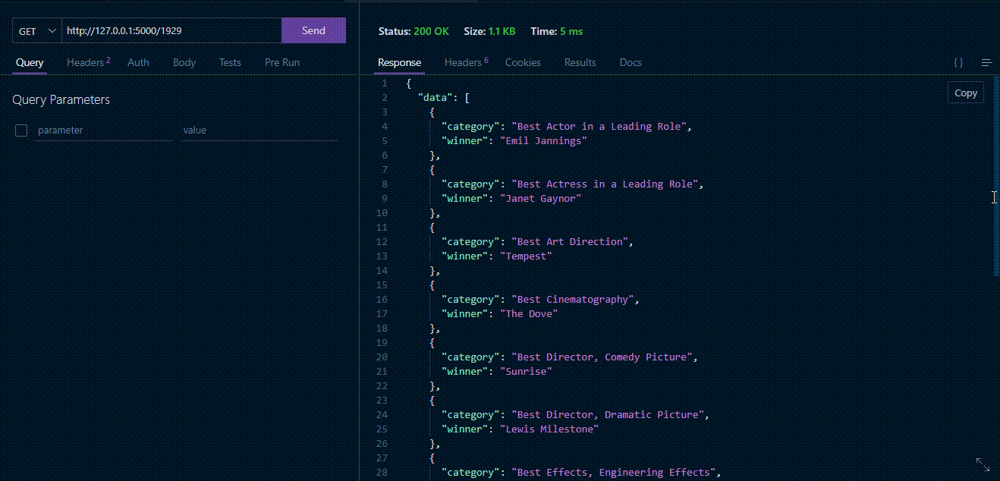

# oscar_winners_list_backend_services
This is a restful service for the "Oscar Winner List" project.

## A bit about OSCAR
The Academy Awards, also known as the Oscars, is an annual awards ceremony honoring outstanding creative and technical achievements in the film industry. The awards are presented by the Academy of Motion Picture Arts and Sciences, and winners are selected by the Academy's voting membership. The various category winners are awarded a copy of a golden statuette, officially called the "Academy Award of Merit," but more commonly referred to by its nickname, the "Oscar".

## Data sourced: https://github.com/abhisaha15/pre-built-database-tables-MySql/blob/main/oscar_data.sql

## How It Works:

### Scenario-1:

### Scenario-2:

### Scenario-3:

Oscar Awards from 1929-2023 are available in this database and changes in category throughout this time frame are also stored.
Movies-based awards are only stored in database

## Summary:

<ul>
  <li>Nominations of each category are not present in the database.</li>
  <li>Person-based awards like an honorary award, jean Hersholt humanitarian award winners data are not present in the database.</li>
</ul>
